# API to MCP Gateway

[English](#english) | [Türkçe](#türkçe)

---

<a name="english"></a>
## English

API to MCP Gateway is a modern, open-source platform that acts as a bridge between standard REST/OpenAPI Web APIs and the [Model Context Protocol (MCP)](https://modelcontextprotocol.io/). It dynamically converts REST endpoints into MCP tools, enabling LLM clients (such as Cursor, Claude Desktop, or n8n) to seamlessly and safely interact with your APIs through a unified interface.

Built entirely using a modern and high-performance stack (**TypeScript + Next.js App Router**), this project provides a unified architecture for API management, OpenAPI spec ingestion, secure credential encryption, and MCP server hosting.

### Key Features

- 🔌 **Dynamic OpenAPI Parsing:** Upload OpenAPI/Swagger specification files or fetch them from a URL to instantly register endpoints.
- 🛠️ **Auto-Tool Extraction:** Automatically map REST endpoints into standard MCP tools.
- 🔒 **Secure Credential Storage:** Encrypt target API headers, tokens, and keys at rest using military-grade **AES-256-CBC** encryption.
- 🛡️ **SSRF Protection:** Built-in security guard preventing Server-Side Request Forgery when importing remote schemas.
- 🚀 **Dual MCP Transport:** Exposes both an **HTTP MCP endpoint** (ideal for web/cloud integrations like n8n) and a **stdio MCP process** (perfect for local clients like Claude Desktop).
- 💻 **Elegant Dashboard:** Manage integrations, credentials, endpoints, and tools via a fully responsive Web UI.

---

### System Architecture

```mermaid
graph TD
    %% Subgraph 1: Clients
    subgraph Clients ["<font size=4 color='#3b82f6'>■ Clients / LLM Hosts</font>"]
        Claude["<b>Claude Desktop</b><br/><i>(stdio)</i>"]
        Cursor["<b>Cursor / IDE</b><br/><i>(HTTP)</i>"]
        n8n["<b>n8n Workflows</b><br/><i>(HTTP)</i>"]
        Admin["<b>Developer / Admin</b><br/><i>(Web Browser)</i>"]
    end

    %% Subgraph 2: Gateway
    subgraph Gateway ["<font size=4 color='#10b981'>■ API to MCP Gateway (Next.js)</font>"]
        STDIO["<b>stdio Entry</b><br/><i>mcp/stdio.ts</i>"]
        HTTP_EP["<b>HTTP MCP Route</b><br/><i>api/mcp/route.ts</i>"]
        UI["<b>Dashboard UI</b><br/><i>app/(dashboard)</i>"]
        
        ServerCore["<b>MCP Server Core</b><br/><i>lib/mcp/server.ts</i>"]
        Parser["<b>Spec Parser</b><br/><i>lib/server/spec-parser.ts</i>"]
        Proxy["<b>API Proxy</b><br/><i>lib/mcp/api-proxy.ts</i>"]
        Crypto["<b>Crypto Service</b><br/><i>lib/server/crypto.ts</i>"]
    end

    %% Subgraph 3: Storage
    subgraph Storage ["<font size=4 color='#a78bfa'>■ Database / Data Layer</font>"]
        Prisma["<b>Prisma ORM</b><br/><i>lib/db.ts</i>"]
        DB[("<b>PostgreSQL DB</b>")]
    end

    %% Subgraph 4: External Services
    subgraph External ["<font size=4 color='#f59e0b'>■ Target Services / External APIs</font>"]
        ExtAPI["<b>External Web APIs</b><br/><i>(Target Endpoints)</i>"]
    end

    %% Connections
    %% Clients to Entrypoints
    Claude ==> STDIO
    Cursor ==> HTTP_EP
    n8n ==> HTTP_EP
    Admin ==> UI

    %% Entrypoints to Core / Actions
    STDIO --> ServerCore
    HTTP_EP --> ServerCore
    
    %% UI & Parser Flow
    UI --> Parser
    Parser --> Prisma
    
    %% Core DB loading
    ServerCore --> Prisma
    Prisma --> DB
    
    %% Execution Flow
    ServerCore --> Proxy
    Proxy <--> Crypto
    Proxy ==> ExtAPI

    %% Styling Nodes
    classDef clientNode fill:#1e2937,stroke:#3b82f6,stroke-width:2px,color:#fff;
    classDef gatewayNode fill:#1f2937,stroke:#10b981,stroke-width:2px,color:#fff;
    classDef dbNode fill:#1e1b4b,stroke:#a78bfa,stroke-width:2px,color:#fff;
    classDef extNode fill:#78350f,stroke:#f59e0b,stroke-width:2px,color:#fff;

    class Claude,Cursor,n8n,Admin clientNode;
    class STDIO,HTTP_EP,UI,ServerCore,Parser,Proxy,Crypto gatewayNode;
    class Prisma,DB dbNode;
    class ExtAPI extNode;

    %% Subgraph Styling
    style Clients fill:#111827,stroke:#3b82f6,stroke-width:2px;
    style Gateway fill:#0b0f19,stroke:#10b981,stroke-width:2px;
    style Storage fill:#11101b,stroke:#a78bfa,stroke-width:2px;
    style External fill:#14110b,stroke:#f59e0b,stroke-width:2px;
```



#### How the System Works
1. **Management & Config:** Developers define integrations, upload OpenAPI schemas, and register authentication credentials securely via the Web Dashboard.
2. **Database Ingestion:** Schemas are parsed and stored as structured endpoints in the PostgreSQL database using Prisma ORM.
3. **MCP Hosting:** The gateway listens for requests on both HTTP and stdio channels.
4. **Proxy & Security:** When an LLM executes a tool, the Gateway loads the endpoint configuration, decrypts the API credentials in memory via AES-256-CBC, constructs the secure HTTP request, forwards it to the target service, and returns the response in standard MCP format.

---

### Tech Stack

- **Framework:** Next.js 15 (App Router), React 19, TypeScript
- **Styling & UI:** Tailwind CSS + shadcn/ui (new-york style), lucide-react, sonner
- **Database:** Prisma ORM with PostgreSQL
- **Protocol & Communication:** `@modelcontextprotocol/sdk`, axios, zod

### Project Structure

```
app/
  (dashboard)/integrations/...   # Responsive management dashboard (Server Components)
  api/integrations/**            # REST API Route Handlers for dashboard config
  api/mcp/route.ts               # MCP HTTP transport route (listTools, callTool)
lib/
  db.ts                          # Prisma database client singleton
  server/crypto.ts               # AES-256-CBC encryption for credential security
  server/ssrf-guard.ts           # SSRF protection layer for secure URL imports
  server/spec-parser.ts          # OpenAPI/Swagger spec parsing logic
  server/services/*              # Business logic services (integrations, credentials, specs)
  mcp/*                          # MCP core server, proxying and schema translation
  validation/schemas.ts          # Zod validation schemas
components/ui/*                  # Shared shadcn/ui components
components/features/*            # Integration, credential, spec, endpoint, and tool dashboard panels
mcp/stdio.ts                     # Claude Desktop stdio MCP server entrypoint
prisma/schema.prisma             # PostgreSQL database schema
```

### Installation & Setup

#### Prerequisites
- Node.js 18+ (Node.js 22 recommended)
- PostgreSQL database instance

#### Step 1: Clone and Install
```bash
git clone https://github.com/volkan-m/APItoMCPGateway.git
cd APItoMCPGateway
npm install
```

#### Step 2: Configure Environment
Copy the example environment file and adjust the values:
```bash
cp ENV.EXAMPLE .env
```

#### Step 3: Database Migration
Generate Prisma client and run migrations:
```bash
npx prisma generate
npx prisma migrate deploy
```

#### Step 4: Run Development Server
```bash
npm run dev
```
Open [http://localhost:3000](http://localhost:3000) in your browser.

---

### Environment Variables

| Variable | Description |
|---|---|
| `DATABASE_URL` | PostgreSQL connection string (Prisma) |
| `ENCRYPTION_KEY` | Key used to encrypt and decrypt API credentials at rest (32-character string). |
| `BEARER_TOKEN` | Optional fallback authorization token for the proxy. |
| `AUTH_TOKEN` | Secret token used to secure the dashboard and API endpoints. If left blank, auth is **disabled** (development mode). |
| `ADMIN_PASSWORD` | Password required to log into the web dashboard (used alongside `AUTH_TOKEN`). |
| `INTEGRATION_ID` | Default integration ID used when starting the stdio server (`mcp/stdio.ts`). |
| `MCP_PROXY_INSECURE_TLS` | Set to `true` to disable TLS certificate verification (useful for internal/self-signed target APIs). |
| `MCP_TOOL_CACHE_TTL_MS` | Cache TTL (ms) for endpoint definitions in the MCP HTTP transport. Default: `5000`. |

---

### MCP Client Integration

#### Option A: HTTP (Cursor, n8n, etc.)
Send a POST request to `/api/mcp` with the header `X-Integration-Id`:

- **List Tools:**
```bash
curl -X POST http://localhost:3000/api/mcp \
  -H "Content-Type: application/json" \
  -H "X-API-Key: $AUTH_TOKEN" \
  -H "X-Integration-Id: <integration-id>" \
  -d '{ "method": "listTools" }'
```

- **Call Tool:**
```bash
curl -X POST http://localhost:3000/api/mcp \
  -H "Content-Type: application/json" \
  -H "X-API-Key: $AUTH_TOKEN" \
  -H "X-Integration-Id: <integration-id>" \
  -d '{
        "method": "callTool",
        "params": { "name": "<tool-name>", "arguments": {} }
      }'
```

#### Option B: stdio (Claude Desktop)
Add the configuration below to your `claude_desktop_config.json`:
```json
{
  "mcpServers": {
    "api-to-mcp": {
      "command": "npm",
      "args": ["run", "mcp:stdio"],
      "cwd": "c:/Sources/BruteForceRepo/APItoMCPGateway",
      "env": { "INTEGRATION_ID": "<integration-id>" }
    }
  }
}
```

---

### Contributing & Open Source

Contributions are highly welcome! We follow standard open-source conventions:

1. **Fork the repository** on GitHub.
2. **Create a feature branch** from `main` (`git checkout -b feature/amazing-feature`).
3. **Commit your changes** with clear and descriptive messages.
4. **Make sure your code compiles** and matches the project structure (`npm run typecheck`).
5. **Open a Pull Request** explaining your enhancements or bug fixes.

---

### License

This project is licensed under the [MIT License](LICENSE). Feel free to use, modify, and distribute it.

---

<a name="türkçe"></a>
## Türkçe

API to MCP Gateway, standart REST/OpenAPI Web API'leri ile [Model Context Protocol (MCP)](https://modelcontextprotocol.io/) arasında köprü vazifesi gören, modern ve açık kaynaklı bir platformdur. REST uç noktalarını dinamik olarak MCP araçlarına (tool) dönüştürerek LLM istemcilerinin (Cursor, Claude Desktop, n8n gibi) API'lerinizle birleşik bir arayüz üzerinden güvenli ve yerel şekilde çalışmasını sağlar.

Tamamen modern ve yüksek performanslı bir teknoloji yığını (**TypeScript + Next.js App Router**) ile geliştirilen proje; API yönetimi, OpenAPI şeması aktarımı, güvenli kimlik bilgisi şifreleme ve MCP sunucusu barındırma işlemlerini tek bir çatı altında toplar.

### Temel Özellikler

- 🔌 **Dinamik OpenAPI Analizi:** OpenAPI/Swagger spesifikasyon dosyalarını yükleyerek veya uzak bir URL'den çekerek uç noktalarınızı anında kaydedin.
- 🛠️ **Otomatik Araç Çıkarımı:** REST uç noktalarını standart MCP araçlarına (tools) otomatik olarak dönüştürün.
- 🔒 **Güvenli Kimlik Bilgisi Depolama:** API anahtarlarını, token'ları ve başlık bilgilerini veritabanında askeri düzeyde **AES-256-CBC** algoritmasıyla şifrelenmiş olarak saklayın.
- 🛡️ **SSRF Koruması:** Uzak şemaları içe aktarırken Server-Side Request Forgery (Sunucu Tarafı İstek Sahteciliği) açıklarını engelleyen dahili güvenlik mekanizması.
- 🚀 **Çift Yönlü MCP Sunumu:** Hem web/bulut entegrasyonları (n8n gibi) için uygun bir **HTTP MCP uç noktası** hem de yerel istemciler (Claude Desktop gibi) için ideal bir **stdio MCP süreci** sunar.
- 💻 **Modern Yönetim Paneli:** Entegrasyonları, kimlik bilgilerini, uç noktaları ve araçları tamamen duyarlı (responsive) bir web arayüzü üzerinden yönetin.

---

### Sistem Mimarisi

```mermaid
graph TD
    %% Subgraph 1: İstemciler
    subgraph Clients ["<font size=4 color='#3b82f6'>■ İstemciler / LLM Sunucuları</font>"]
        Claude["<b>Claude Desktop</b><br/><i>(stdio)</i>"]
        Cursor["<b>Cursor / IDE</b><br/><i>(HTTP)</i>"]
        n8n["<b>n8n İş Akışları</b><br/><i>(HTTP)</i>"]
        Admin["<b>Geliştirici / Yönetici</b><br/><i>(Tarayıcı)</i>"]
    end

    %% Subgraph 2: Gateway
    subgraph Gateway ["<font size=4 color='#10b981'>■ Next.js Gateway Uygulaması</font>"]
        STDIO["<b>stdio Girişi</b><br/><i>mcp/stdio.ts</i>"]
        HTTP_EP["<b>HTTP MCP Uç Noktası</b><br/><i>api/mcp/route.ts</i>"]
        UI["<b>Yönetim Paneli (UI)</b><br/><i>app/(dashboard)</i>"]
        
        ServerCore["<b>MCP Sunucu Çekirdeği</b><br/><i>lib/mcp/server.ts</i>"]
        Parser["<b>Spesifikasyon Ayrıştırıcı</b><br/><i>lib/server/spec-parser.ts</i>"]
        Proxy["<b>API Proxy Katmanı</b><br/><i>lib/mcp/api-proxy.ts</i>"]
        Crypto["<b>Crypto Servisi</b><br/><i>lib/server/crypto.ts</i>"]
    end

    %% Subgraph 3: Veri Tabanı
    subgraph Storage ["<font size=4 color='#a78bfa'>■ Veritabanı / Veri Katmanı</font>"]
        Prisma["<b>Prisma ORM</b><br/><i>lib/db.ts</i>"]
        DB[("<b>PostgreSQL Veritabanı</b>")]
    end

    %% Subgraph 4: Dış Servisler
    subgraph External ["<font size=4 color='#f59e0b'>■ Hedef Servisler / Dış API'ler</font>"]
        ExtAPI["<b>Dış Web API'leri</b><br/><i>(Hedef Uç Noktalar)</i>"]
    end

    %% Bağlantılar
    %% İstemcilerden Giriş Noktalarına
    Claude ==> STDIO
    Cursor ==> HTTP_EP
    n8n ==> HTTP_EP
    Admin ==> UI

    %% Giriş Noktalarından Çekirdek İşlemlere
    STDIO --> ServerCore
    HTTP_EP --> ServerCore
    
    %% Arayüz ve Ayrıştırıcı Akışı
    UI --> Parser
    Parser --> Prisma
    
    %% Çekirdek Veri Erişimleri
    ServerCore --> Prisma
    Prisma --> DB
    
    %% İstek Yönlendirme & Şifre Çözme Akışı
    ServerCore --> Proxy
    Proxy <--> Crypto
    Proxy ==> ExtAPI

    %% Düğüm Stilleri
    classDef clientNode fill:#1e2937,stroke:#3b82f6,stroke-width:2px,color:#fff;
    classDef gatewayNode fill:#1f2937,stroke:#10b981,stroke-width:2px,color:#fff;
    classDef dbNode fill:#1e1b4b,stroke:#a78bfa,stroke-width:2px,color:#fff;
    classDef extNode fill:#78350f,stroke:#f59e0b,stroke-width:2px,color:#fff;

    class Claude,Cursor,n8n,Admin clientNode;
    class STDIO,HTTP_EP,UI,ServerCore,Parser,Proxy,Crypto gatewayNode;
    class Prisma,DB dbNode;
    class ExtAPI extNode;

    %% Alt Grafik Stilleri
    style Clients fill:#111827,stroke:#3b82f6,stroke-width:2px;
    style Gateway fill:#0b0f19,stroke:#10b981,stroke-width:2px;
    style Storage fill:#11101b,stroke:#a78bfa,stroke-width:2px;
    style External fill:#14110b,stroke:#f59e0b,stroke-width:2px;
```



#### Sistemin Çalışma Mantığı
1. **Yönetim ve Yapılandırma:** Geliştiriciler, yönetim paneli aracılığıyla entegrasyonları tanımlar, OpenAPI şemalarını sisteme aktarır ve ilgili API kimlik bilgilerini güvenli bir şekilde kaydeder.
2. **Veritabanı Kaydı:** Şemalar otomatik olarak çözümlenerek Prisma ORM yardımıyla PostgreSQL veritabanına yapılandırılmış uç noktalar olarak kaydedilir.
3. **MCP Sunumu:** Gateway, hem HTTP hem de stdio kanalları üzerinden gelen talepleri dinler.
4. **Proxy ve Güvenlik:** LLM bir aracı çalıştırdığında, Gateway uç nokta tanımını yükler, API anahtarlarını bellek üzerinde AES-256-CBC ile çözer, güvenli HTTP isteğini oluşturup hedef dış servise iletir ve yanıtı MCP standart formatında istemciye geri döner.

---

### Teknoloji Yığını

- **Framework:** Next.js 15 (App Router), React 19, TypeScript
- **Tasarım & UI:** Tailwind CSS + shadcn/ui (new-york tarzı), lucide-react, sonner
- **Veritabanı:** Prisma ORM ve PostgreSQL
- **Protokol:** `@modelcontextprotocol/sdk`, axios, zod

### Proje Yapısı

```
app/
  (dashboard)/integrations/...   # Duyarlı yönetim paneli (Server Components)
  api/integrations/**            # Yönetim paneli yapılandırma REST API Route Handler'ları
  api/mcp/route.ts               # MCP HTTP taşıyıcı uç noktası (listTools, callTool)
lib/
  db.ts                          # Prisma veritabanı istemcisi singleton
  server/crypto.ts               # Kimlik bilgileri güvenliği için AES-256-CBC şifreleme
  server/ssrf-guard.ts           # Güvenli URL içe aktarımları için SSRF koruması
  server/spec-parser.ts          # OpenAPI/Swagger spesifikasyonu ayrıştırma mantığı
  server/services/*              # İş mantığı servisleri (entegrasyonlar, kimlik bilgileri, specs)
  mcp/*                          # MCP çekirdek sunucusu, yönlendirme ve şema dönüşümü
  validation/schemas.ts          # Zod doğrulama şemaları
components/ui/*                  # Paylaşılan shadcn/ui bileşenleri
components/features/*            # Arayüz entegrasyon, kimlik bilgisi, endpoint ve tool panelleri
mcp/stdio.ts                     # Claude Desktop stdio MCP sunucu giriş noktası
prisma/schema.prisma             # PostgreSQL veritabanı şeması
```

### Kurulum ve Yapılandırma

#### Gereksinimler
- Node.js 18+ (Node.js 22 önerilir)
- PostgreSQL veritabanı sunucusu

#### Adım 1: Projeyi Klonlayın ve Bağımlılıkları Kurun
```bash
git clone https://github.com/volkan-m/APItoMCPGateway.git
cd APItoMCPGateway
npm install
```

#### Adım 2: Ortam Değişkenlerini Ayarlayın
Örnek ortam dosyasını kopyalayın ve değerleri düzenleyin:
```bash
cp ENV.EXAMPLE .env
```

#### Adım 3: Veritabanı Şemasını Uygulayın
Prisma istemcisini oluşturun ve veritabanı tablolarını hazırlayın:
```bash
npx prisma generate
npx prisma migrate deploy
```

#### Adım 4: Geliştirme Sunucusunu Başlatın
```bash
npm run dev
```
Tarayıcınızda [http://localhost:3000](http://localhost:3000) adresini açarak yönetim paneline ulaşabilirsiniz.

---

### Ortam Değişkenleri

| Değişken | Açıklama |
|---|---|
| `DATABASE_URL` | PostgreSQL bağlantı adresi (Prisma) |
| `ENCRYPTION_KEY` | API kimlik bilgilerini veritabanında şifrelemek ve çözmek için kullanılan 32 karakterlik anahtar. |
| `BEARER_TOKEN` | Proxy istekleri için isteğe bağlı fallback yetkilendirme belirteci (token). |
| `AUTH_TOKEN` | Yönetim paneli ve API uç noktalarını korumak için kullanılan gizli anahtar. Boş bırakılırsa koruma **devre dışı** kalır (geliştirme modu). |
| `ADMIN_PASSWORD` | Yönetim paneline giriş için gerekli şifre (`AUTH_TOKEN` ile birlikte kullanılır). |
| `INTEGRATION_ID` | stdio sunucusu (`mcp/stdio.ts`) başlatıldığında kullanılacak varsayılan entegrasyon ID'si. |
| `MCP_PROXY_INSECURE_TLS` | TLS sertifika doğrulamasını kapatmak için `true` yapın (dahili/self-signed hedef API'ler için). |
| `MCP_TOOL_CACHE_TTL_MS` | MCP HTTP taşıyıcısında endpoint tanımları için önbellek süresi (ms). Varsayılan: `5000`. |

---

### MCP İstemci Entegrasyonu

#### Yöntem A: HTTP (Cursor, n8n vb.)
`/api/mcp` adresine `X-Integration-Id` başlığı ile bir POST isteği gönderin:

- **Araçları Listele (List Tools):**
```bash
curl -X POST http://localhost:3000/api/mcp \
  -H "Content-Type: application/json" \
  -H "X-API-Key: $AUTH_TOKEN" \
  -H "X-Integration-Id: <integration-id>" \
  -d '{ "method": "listTools" }'
```

- **Araç Çağır (Call Tool):**
```bash
curl -X POST http://localhost:3000/api/mcp \
  -H "Content-Type: application/json" \
  -H "X-API-Key: $AUTH_TOKEN" \
  -H "X-Integration-Id: <integration-id>" \
  -d '{
        "method": "callTool",
        "params": { "name": "<tool-name>", "arguments": {} }
      }'
```

#### Yöntem B: stdio (Claude Desktop)
Aşağıdaki yapılandırmayı `claude_desktop_config.json` dosyanıza ekleyin:
```json
{
  "mcpServers": {
    "api-to-mcp": {
      "command": "npm",
      "args": ["run", "mcp:stdio"],
      "cwd": "c:/Sources/BruteForceRepo/APItoMCPGateway",
      "env": { "INTEGRATION_ID": "<integration-id>" }
    }
  }
}
```

---

### Katkıda Bulunma & Açıklık Politikası

Katkılarınızı sabırsızlıkla bekliyoruz! Standart açık kaynaklı iş akışlarını takip ediyoruz:

1. Bu depoyu **fork edin**.
2. `main` dalından yeni bir özellik dalı oluşturun (`git checkout -b feature/amazing-feature`).
3. Değişikliklerinizi açıklayıcı commit mesajlarıyla **commit edin**.
4. Kodun derlendiğinden ve hata içermediğinden emin olun (`npm run typecheck`).
5. Geliştirmelerinizi açıklayan bir **Pull Request (PR)** açın.

---

### Lisans

Bu proje [MIT Lisansı](LICENSE) ile lisanslanmıştır. Özgürce kullanabilir, değiştirebilir ve dağıtabilirsiniz.
